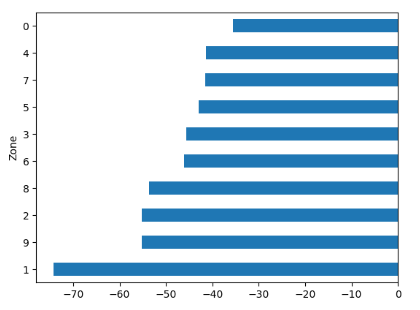

# London Tube Pandemic Resilience Analysis


## What is this project about?
During the COVID-19 pandemic, travel across London changed drastically. This project looks at London Underground passenger data from Transport for London (TfL) to see how different areas (Zones 1 through 6) and specific tube stations handled the lockdowns. 
* **Data Sources:** 

The goal was to find out **which areas saw the biggest drop in passengers** and **which stations were hit the hardest.**

## Project Structure
```
├── .gitignore                      
├── LICENSE                         
├── README.md                       
├── tfl_stations.csv
├── london_tube_pandemic_analysis.ipynb
└── zone_impact_chart.png

```
## Visualisations


## How I Built It & The Data Cleaning Phase
The initial data contained tracking for millions of passengers, but it also included overground trains and newer extensions. Because TfL expanded its network over the years, running math on the raw data would leave massive gaps and skew the results.

To keep the project clean, I focused strictly on classic London Underground stations and filtered out the noise using Pandas in Python: 
```python
tube_df = tube_df[tube_df['London Underground'] == 'Yes']

```

## Data Analysis & Key Findings
### Finding the Busiest Stations (Pre-Pandemic Baseline)
Before looking at the pandemic's impact, I needed to understand what "normal" looked like by sorting to find the absolute busiest station before the pandemic.
```python
busiest_stations = tube_df.sort_values('En/Ex 2019', ascending=False)
busiest_stations.head(1)

```
* **Result:** Stratford was the busiest station in London. Unlike classic tourist hubs, Stratford is a massive interchange connecting multiple train lines, the DLR, and a major shopping center, making it London's top transit bottleneck.

## Remaining Busy During Lockdown
I ran the same query on the 2020 data to see which stations managed to keep footfall3 even during strict lockdowns.

## Identifying the Most Impacted Stations
Next, I reversed the sorting to find out which stations saw the lowest passenger volumes during the peak of the pandemic.
* **Result:** Heathrow Terminal 4 recorded an absolute flat 0.0 passenger count. 
* **The Story Behind the Data:** At first, this looked like a code bug. However, historical research confirmed the data was entirely accurate. Heathrow Airport completely shut down Terminal 4 in April 2020 to save money during the global travel ban. Because the terminal was locked, TfL closed the tube station entirely from May 2020 until June 2022.

## Measuring the Percentage Drop Across Stations
While a massive station like Stratford lost 40 million passengers, its sheer size kept it number one. To find out who got hit the hardest proportionally, I calculated the exact percentage drop for every station:
```python
tube_df['Pct_Drop'] = ((tube_df['En/Ex 2020'] - tube_df['En/Ex 2019']) / tube_df['En/Ex 2019']) * 100

```
* **The Biggest Drops:** Heathrow Terminal 4 (-100%) and Covent Garden (~90%). Covent Garden relies completely on theatres, shopping, and international tourists. When the West End went dark, the station became a ghost town.
* **The Most Resilient:** Battersea Power Station held up incredibly well, seeing only an -11% drop. Because it is a heavily residential area, local residents were still walking around and using transit for essential daily travel.
  
## Geographic Deep Dive: Merging Datasets to Prove a Theory
I noticed that entire lines slicing through the heart of London, like the Bakerloo and Piccadilly lines suffered an incredible average drop of 89%. I suspected this was a location problem, not a line problem.

To prove this, I needed to compare Zone 1 (central London) against Zones 4, 5, and 6. However, my original dataset didn't include zone classifications. To fix this, I found an open-source spatial dataset of London stations and merged them together: 
```python
merged_df = pd.merge(tube_df, zone_lookup, left_on='Station', right_on='NAME')

# Finding the average percentage drop grouped by geographical zone
merged_df.groupby('Zone')['Pct_Drop'].mean().sort_values(ascending=True).plot(kind='barh')

```
* **Result:** This completely confirmed my theory. Zone 1 (Central London) took the worst hit with an average passenger drop of -70.4%, while outer-zone residential stations proved to be vastly more resilient.

## Visualisation
I plotted the average drop across different zones into a horizontal bar chart to give an instant, clear view of how central London emptied out compared to the suburbs:

## Core Takeaways
**The Big Picture:** London transit took a massive hit, with central tourist and theatre-heavy lines averaging an 89% passenger loss.

**The Geographic Shift:** By joining two separate datasets, I proved that Zone 1 central commuter hubs collapsed by over 70%, while residential outer suburbs stayed active.

**Data Outliers:** The dataset holds real history perfectly capturing the multi-year closure of Heathrow Terminal 4 (-100%) and the local resilience of residential extensions like Battersea.


[← Back to Main Portfolio](https://github.com/araba07/Analytics-Portfolio)
